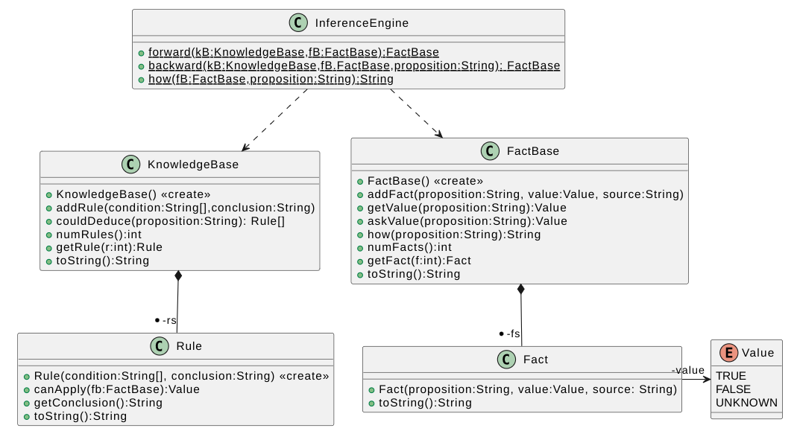
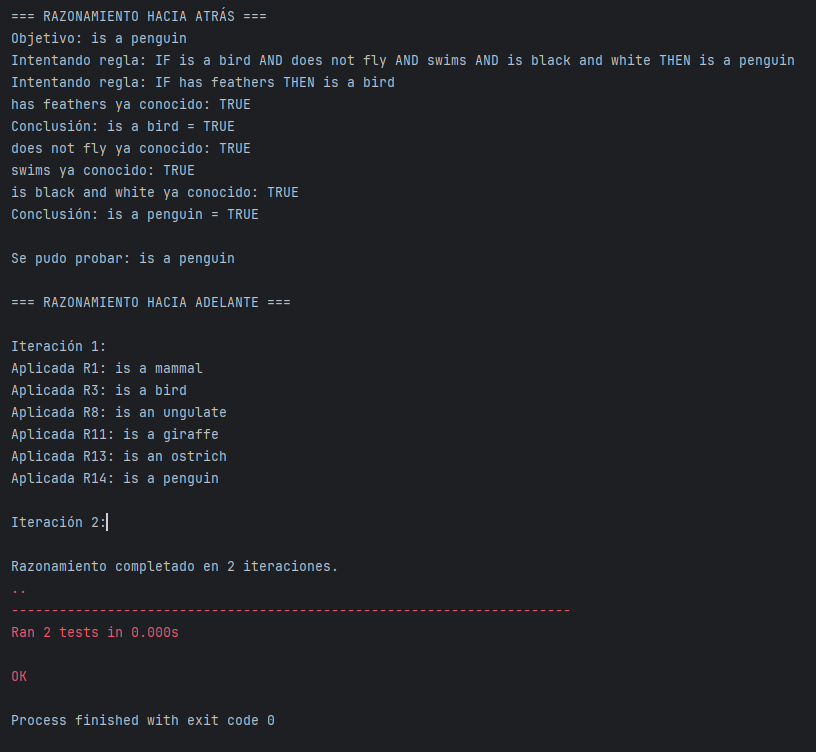

# BÚSQUEDA ADVERSARIA

**LABORATORIO 4/4**

**ESCUELA COLOMBIANA DE INGENIERÍA**

**PRINCIPIOS Y TECNOLOGÍAS IA 2025-2**

## Integrantes
- Andres Felipe Calderon Ramirez - [andrescalderonr](https://github.com/andrescalderonr)
- Santiago Botero Garcia - [LePeanutButter](https://github.com/LePeanutButter)


**OBJETIVOS**

Desarrollar competencias básicas para:

1.  Diseña entornos de inteligencia artificial simbólica
2.  Desarrolla lógica de razonamiento simbólico basada en reglas y
    lógica
3.  Implementa motores de inferencia y gestores de hechos y reglas

**ENTREGABLE**

*Reglas para el envío de los entregables*:

-   **Forma de envío:** Este laboratorio se debe enviar únicamente a
    través de la plataforma Moodle en la actividad definida. Se tendrán
    dos entregas: inicial y final.

-   **Formato de los archivos:** Incluyan en un archivo *.zip* los
    archivos correspondientes al laboratorio.

-   **Nomenclatura para nombrar los archivos:** El archivo deberá ser
    renombrado, "KB-lab-" seguido por los usuarios institucionales de
    los autores ordenados alfabéticamente (por ejemplo, se debe
    adicionar pedroperez al nombre del archivo, si el correo electrónico
    de Pedro Pérez es <pedro.perez@mail.escuelaing.edu.co>)

# **IMPLEMENTACIÓN DE MOTOR DE INFERENCIA**

**IMPLEMENTAR un sistema basado en reglas ($KB⊨α$) con las siguientes
simplificaciones del lenguaje:**

-   Su elemento básico: proposiciones con valores
    $\alpha \in \left\{T: true, F: false, U: unknown\right\}$
-   Las reglas tienen una única conclusión: la afirmación de una
    proposición
-   Conectivo lógico: su uníco conectivo en las condiciones
    (antecedente) es **AND** $(\bigwedge)$

**El sistema deberá permitir:**

-   Crear un sistema basado en conocimientos
-   Dada una base de hechos, hacer razonamiento adelante.
-   Dada una conclusión, hacer razonamiento atrás.
-   Explicar el CÓMO de una conclusión

``` python
from abc import ABC, abstractmethod
from __future__ import annotations
from typing import List
```

## PARTE I. RAZONAMIENTO Y REPRESENTACIÓN DEL LENGUAJE 

Implementar un sistema basado en conocimiento desde la definición de la
estructura de datos, las inferencias hacia adelante y hacia atras, y la
conclusión del motor.



### SEMÁNTICA Y SINTAXIS: BASE DE HECHOS

``` python
from enum import Enum

class Value(Enum):
  """ definicion semantica de los valores de las proposiciones del lenguaje establecido
  """
```

``` python
class Fact():
  """ definicion de hechos bajo el lenguaje establecido y su sintaxis
  """

  @classmethod
  def Fact(proposition: str, value: Value, source: String):
    """ establece un nuevo hecho
    Args:
      proposition: nombre de la proposicion
      value: valor que toma la proposición
      source: fuente que dio el valor para la proposicion: usuario o regla
    Returns:
    """
    pass

  def toString() -> str:
    """ muestra la expresión de un hecho en el lenguaje
    Args:
    Returns:
      hecho en lenguaje natural: nombre, valor y fuente que permitio conocer su valor
    """
    pass
```

``` python
class FactBase():
  """ base de conocimiento a partir de reglas bajo la sintaxis pertinente
  """
  @classmethod
  def FactBase():
    """ establece una base de hechos bajo el lenguaje
    Args:
    Returns:
    """
    pass

  def addFact(proposition: str, value: Value, source: String):
    """ establece una nueva base de hechos en la sintaxis
    Args:
      proposition: nombre de la proposicion
      value: valor de la proposición
      source: source: fuente que dio el valor para la proposicion: usuario o regla
    Returns:
    """
    pass

  def getValue(proposition: str) -> Value:
    """ obtiene el valor de una proposición
    Args:
      proposition: nombre de la proposicion
    Returns:
      valor semántico de la regla
    """
    pass

  def askValue(proposition: str) -> Value:
    """ le pregunta al usuario el valor de una proposición
    Args:
      proposition: nombre de la proposicion
    Returns:
      valor semántico de la regla
    """
    pass

  def numFacts() -> int:
    """ determina cantidad de hechos en la base
    Args:
    Returns:
      número de hechos
    """
    pass

  def getFact(f: int) -> Fact:
    """ obtiene el hecho según su indicador
    Args:
      r: indice del hecho
    Returns:
      hecho
    """
    pass

  def toString() -> str:
    """ muestra la expresión de una base de hechos en el lenguaje
    Args:
    Returns:
      base de hechos en lenguaje natural
    """
    pass
```

### SEMÁNTICA Y SINTAXIS: BASE DE CONOCIMIENTO (REGLAS)

``` python
class Rule():
  """ definicion de reglas bajo el lenguaje establecido y su sintaxis
  """

  @classmethod
  def Rule(condition: List[str], conclusion: str):
    """ establece una nueva regla en la sintaxis del lenguaje
    Args:
      condition: lista de reglas en lenguaje natural (antecedentes)
      conclusion: proposición que implica de la regla (consecuente)
    Returns:
    """
    pass

  def canApply(fB: FactBase) -> Value:
    """ evalua la semantica de la regla a partir de los hechos
    Args:
      fB: base de hechos que se perciben
    Returns:
       valor semántico de la regla
    """
    pass

  def getConclusion() -> str:
    """ obtener la conclusion que implica (entail) de la regla
    Args:
    Returns:
       proposicion consecuente
    """
    pass

  def toString() -> str:
    """ muestra la expresión de una regla en el lenguaje
    Args:
    Returns:
      regla en lenguaje natural
    """
    pass
```

``` python
class KnowledgeBase():
  """ base de conocimiento a partir de reglas bajo la sintaxis pertinente
  """
  @classmethod
  def KnowledgeBase():
    """ establece una base de conocimiento basada en reglas
    Args:
    Returns:
    """
    pass

  def addRule(condition: List[str], conclusion: str):
    """ añade una nueva regla a la base de conocimiento
    Args:
      condition: lista de proposiones (antecedentes)
      conclusion: proposición que implica de la regla (consecuente)
    Returns:
    """
    pass

  def couldDeduce(proposition: str) -> List[Rule]:
    """ sustrae las reglas que permiten concluir una proposicion
    Args:
      proposition: nombre de la proposicion
    Returns:
      listado de las reglas desencadenadas
    """
    pass

  def numRules() -> int:
    """ determina cantidad de reglas en la base de conocimiento
    Args:
    Returns:
      número de reglas
    """
    pass

  def getRule(r: int) -> Rule:
    """ obtiene la regla según su indicador
    Args:
      r: indice de la regla
    Returns:
      regla
    """
    pass

  def toString() -> str:
    """ muestra la expresión de una base de conocimiento de reglas en el lenguaje
    Args:
    Returns:
      base de reglas en lenguaje natural
    """
    pass
```

### MOTOR DE INFERENCIA

``` python
class InferenceEngine():
  """ motor de inferencia para un sistema basado en conocimiento con base de reglas
  """

  @classmethod
  def forward(kB: KnowledgeBase, fB: FactBase) -> FactBase:
    """ generar una inferencia con razonamiento hacia adelante
    Args:
      kB: base de conocimiento a base de reglas
      fB: base de hechos que se perciben
    Returns:
       base de hechos actualizada con nuevos hechos inferidos
    """
    pass

  @classmethod
  def backward(kB: KnowledgeBase, fB: FactBase, proposition: str) -> FactBase:
    """ generar una inferencia con razonamiento hacia atras
    Args:
      kB: base de conocimiento a base de reglas
      fB: base de hechos que se perciben
      proposition: nombre de la proposicion, formulada como hipotesis
    Returns:
       base de hechos actualizada con nuevos hechos inferidos
    """
    pass


  @classmethod
  def how(fB: FactBase, proposition: str) -> String:
    """ consultar la fuente de conocimiento del valor de la proposición
    Args:
      proposition: nombre de la proposicion
    Returns:
      valor y fuente de información de la proposición
    """
    pass
```

### IMPLEMENTACIÓN DE MOTOR DE INFERENCIA

Se implementó un sistema basado en reglas siguiendo la simplificación del lenguaje propuesta, donde los elementos básicos son proposiciones con valores de verdad (true, false o unknown). Las reglas del sistema cuentan con una única conclusión y sus condiciones se combinan únicamente mediante el conectivo AND.

El motor de inferencia desarrollado permite:

- Crear y mantener una base de conocimiento compuesta por reglas y hechos.
- Realizar razonamiento hacia adelante (forward chaining), deduciendo nuevos hechos a partir de los ya conocidos y las reglas definidas.
- Realizar razonamiento hacia atrás (backward chaining), verificando si una hipótesis específica puede ser inferida a partir de los hechos y reglas disponibles.
- Explicar el cómo de cada conclusión, identificando la fuente y la secuencia de reglas que permitió deducir un hecho.

La implementación incluye estructuras de datos para representar hechos, reglas y sus respectivas bases, así como el motor de inferencia capaz de actualizar la base de hechos según las reglas aplicables y de rastrear la justificación de cada inferencia.

Este sistema permite modelar de manera efectiva escenarios de razonamiento experto, como el caso de uso Zookeeper, donde a partir de características conocidas de animales se puede clasificar su especie mediante reglas encadenadas y hechos iniciales.

## PARTE II. IMPLEMENTACIÓN DE BASE DE CONOCIMIENTO - CASO DE USO {#parte-ii-implementación-de-base-de-conocimiento---caso-de-uso}

Implementar en el lenguaje anteriormente definido, las base (hechos y
reglas) de
[ZOOKEEPER](https://drive.google.com/file/d/1C5F-ErRzRd1BSWo6F4jg9TVU9-5YwhPn/view?usp=sharing)

**Generar dos (2) casos de prueba, uno inferencia hacia adelante y el
otro de inferencia hacia atras.**

``` python
# Implementar las bases ZOOKEEPER y establecer dos casos de prueba
```

### IMPLEMENTACIÓN DE ZOOKEEPER

Se implementó la base de conocimiento del Zookeeper utilizando las estructuras previamente definidas para hechos (FactBase) y reglas (KnowledgeBase). La implementación contempla la clasificación de animales, subclasificación de mamíferos y aves, y la identificación de especies específicas, siguiendo el esquema proporcionado en el caso de estudio.

Se definieron las reglas de inferencia para la clasificación de animales y se cargaron hechos iniciales representativos de dos animales: Stretch (giraffe) y Splashy (penguin).

Reglas y hechos implementados:

```python
from src.zookeeper import Zookeeper

# Zookeeper: definición de reglas
kb = Zookeeper.initial_rules()
fb = Zookeeper.initial_working_memory()
```

Se establecieron dos casos de prueba para verificar el correcto funcionamiento del motor de inferencia:

1. **Inferencia hacia adelante (Forward Chaining):**

    Se verifica que, a partir de los hechos de Stretch, el motor de inferencia deduzca correctamente que es una giraffe.

2. **Inferencia hacia atrás (Backward Chaining):**

    Se comprueba que, al preguntar si Splashy es un penguin, el motor de inferencia pueda confirmar correctamente esta conclusión utilizando los hechos y reglas disponibles.

Se desarrollaron y ejecutaron correctamente ambos casos de prueba, verificando que el sistema puede deducir las especies de los animales según los hechos iniciales y las reglas definidas.



## RETROSPECTIVA

**1.** ¿Cuál fue el tiempo total invertido en el laboratorio por cada
uno de ustedes? (Horas/Hombre)

- Andrés Calderón: 6 horas
- Santiago Botero: 5.5 horas

**2.** ¿Cuál es el estado actual del laboratorio? ¿Por qué?

El laboratorio se encuentra completo y funcional. Todas las funcionalidades solicitadas fueron implementadas: creación de la base de hechos y reglas, razonamiento hacia adelante y hacia atrás, y explicación de conclusiones. Además, las pruebas unitarias confirmaron que las inferencias se realizan correctamente.

**3.** ¿Cuál consideran fue el mayor logro? ¿Por qué?

El mayor logro fue la implementación correcta del motor de inferencia, capaz de deducir hechos nuevos y explicar el razonamiento detrás de cada conclusión. Esto se considera un logro porque permitió verificar la efectividad de las reglas y la consistencia de la base de conocimiento en un escenario real (clasificación de animales).

**4.** ¿Cuál consideran que fue el mayor problema técnico? ¿Qué hicieron
para resolverlo?

El mayor problema técnico fue asegurar que las reglas se aplicaran correctamente en el razonamiento hacia atrás, especialmente al manejar dependencias entre hechos ya conocidos. Para resolverlo, se revisó la lógica de evaluación de reglas, se reforzó la estructura de la base de hechos y se implementaron pruebas paso a paso para garantizar que cada condición se verificara antes de inferir la conclusión.

**5.** ¿Qué hicieron bien como equipo? ¿Qué se comprometen a hacer para
mejorar los resultados?

- Lo que hicimos bien: coordinación efectiva, división de tareas, y documentación.
- Compromiso de mejora: mejorar la planificación inicial del laboratorio.

**6**.¿Qué referencias usaron? ¿Cuál fue la más útil? Incluya citas con
los estándares adecuados.

Ninguna

*Incluyan las respuesta*
